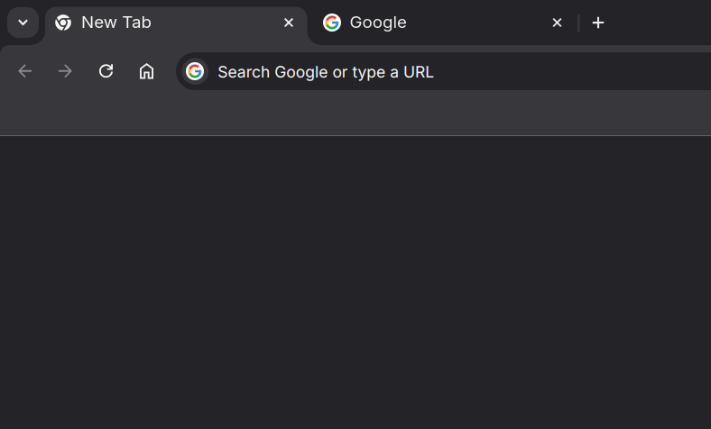
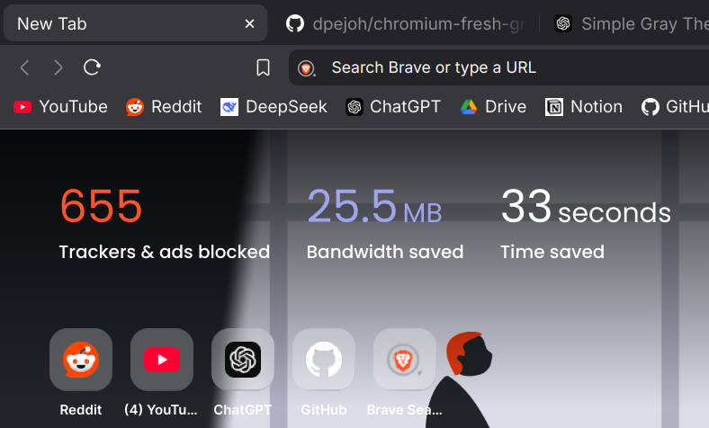

# chromium-fresh-grey
A minimalist gray Chrome theme for a sleek, clean, and modern browsing experience.

## How to Install

1. **Download the theme**:  
   - Click **Code** → **Download ZIP**.  
   - Extract the ZIP file.

2. **Open Extensions**:  
   - Go to `chrome://extensions/` in Chromium or Brave.
   - Enable **Developer mode** (top-right corner).

3. **Load the theme**:  
   - Click **Load unpacked** and select the `src` folder inside the extracted folder.

### Have Questions or Suggestions?

Open an issue here.
